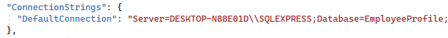

# Employe Profile

The project aims to tidy and ease up the process of handling and managaing the Employees data, departments and ease linking them together.

You can do the ordinary operations you can do to employee profile. You can add new ones or delete the old ones. plus you can update employee data or link them to other departments.

## Technical specs

The project is Web API new core project built with the latest versions of .net (.net 7 and .net core 3.1)

## Packages used

1. AutoMapper : Used to map betwee ViewModels and entity models.
2. log4net : used for logging (Debug and error messages).
3. EF : Used to build object-relation mapper and the data access layer.
4. Swashbuckle and swagger : used to test the APIs from the swagger UI page.

## How to run the application locally.

### Prerequisites

Make sure you have .net core SDK or at least the .net runtime 
installed and you have also to prepare a valid SQL DB server connection weather it is hosted on your machine or other machines you only need a valid connection.

### How to run the app 

Before running the app you should change couple of things

1. DB connection : Navigate to app.settings file and set the value for the key `[ConnectionStrings][DefaultConnection]`

    

    2.Change logging file path : Navigate to log4net.config file and specify the directory path for logging `<file value="D:\TestLog\" />`

Then you can can run the `dotnet run` command in terminal and the app will launch.

>No need to create a DB instance the app will create the DB ,do the migration and seed data automatically.